# Plotting Financial Data Chart with Plotly Python 
- Last update: May 2021
- Environment: Windows 
- Compiler: Conda distribution
- Prerequisite: Refinitiv Eikon or Refinitiv Workspace application with access to Eikon Data APIs.

## <a id="overview"></a>Overview

With the rise of Data Scientists, Financial coders, or Traders (aka Citizen Developers), data visualization is a big part of how to present data, information, and its context to the readers (Financial team, Marketing team, etc.). The good data analysis itself cannot be used with a good graph representation. 

The [Matplotlib Pyplot](https://matplotlib.org/stable/api/_as_gen/matplotlib.pyplot.html) is a de-facto library for making interactive plot and data visualization in the Python and Data Scientists world. However, the [Matplotlib](https://matplotlib.org/) is a huge library that contains several interfaces, capabilities, and 1000+ pages of documents.  

There are a lot of others alternative Plotting libraries such as [Seaborn](https://seaborn.pydata.org/) (which is a high-level interface of Matplotlib), [Spotify](https://www.spotify.com/us/home/)'s [Chartify](https://github.com/spotify/chartify), [Bokeh](https://docs.bokeh.org/en/latest/), [Plotly Python](https://plotly.com/python/), etc.

This example project demonstrates how to use the Plotly Python library to plot various types of graphs. The demo application uses Corona Virus Disease (COVID-19) and Financial data from [Eikon Data API](https://developers.refinitiv.com/en/api-catalog/eikon/eikon-data-api) as an example of a dataset.

## <a id="plotly_intro"></a>Introduction to Plotly Python

[Plotly Python](https://plotly.com/python/) is a [free](https://plotly.com/python/is-plotly-free/) and [open source](https://github.com/plotly/plotly.py) interactive graphing library for Python. The library is built on top of [plotly.js](https://plotly.com/javascript/) JavaScript library ([GitHub](https://github.com/plotly/plotly.js)). Both Plotly Python and Plotly JavaScript are part of [Plotly](https://plotly.com/)'s Dash and Chart Studio applications suites which provide interactively, scientific data visualization libraries/solutions for Data Scientists and Enterprise. 
 
This project will focus on the Plotly Python open-source library versions **4.14.3** and **4.5.2** (In the CodeBook application). 

```
import plotly.express as px

fig = px.line(x=["a","b","c"], y=[1,3,2], title="sample figure")
fig.show('notebook')
```

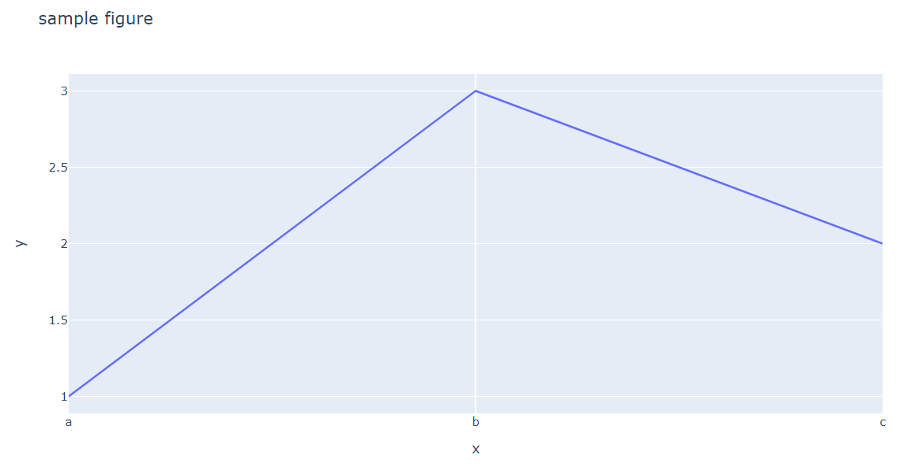 

## <a id="dapi_intro"></a>Introduction to Eikon Data API

The [Eikon Data API](https://developers.refinitiv.com/en/api-catalog/eikon/eikon-data-api) (aka DAPI) provides access to certain Refinitiv Eikon/Refinitiv Workspace data with seamless workflow with the same data across all applications running on the desktop. The API allows developers to tap into the full breadth of community tools through a modern API with native Python support.

 

If you are not familiar with Eikon Data API or Python, the following resources are highly recommended to read before you proceed with further steps.
- [Setting up a Python development environment](https://developers.refinitiv.com/en/api-catalog/eikon/eikon-data-api/tutorials#setting-up-a-python-development-environment).
- [Eikon Data API Quick Start](https://developers.refinitiv.com/en/api-catalog/eikon/eikon-data-api/quick-start).

*Note*:
- This project is based on Eikon Data API versions **1.1.10** and **1.1.6.post3** (In the CodeBook application).
- Pleases see [Eikon Data API Usage and Limits Guideline](https://developers.refinitiv.com/en/api-catalog/eikon/eikon-data-api/documentation#eikon-data-api-usage-and-limits-guideline) regarding the API data coverage and data limit. 

## <a id="prerequisite"></a>Prerequisite
This example requires the following dependencies software and libraries.
1. Refinitiv Eikon or Refinitiv Workspace application with access to Eikon Data APIs.
2. Python [Anaconda](https://www.anaconda.com/distribution/) or [MiniConda](https://docs.conda.io/en/latest/miniconda.html) distribution/package manager.
3. [Classic Jupyter Notebook](https://jupyter.readthedocs.io/en/latest/install/notebook-classic.html) or [JupyterLab](https://jupyterlab.readthedocs.io/en/stable/getting_started/installation.html) applications
4. Internet connection.

*Note:* 
- This Project has been qualified with Python version 3.8.8 and Conda version 4.10.1

Please contact your Refinitiv's representative to help you to access Refinitiv Workspace/Eikon credentials. You can generate/manage the AppKey by follow the steps in [Eikon Data API Quick Start](https://developers.refinitiv.com/en/api-catalog/eikon/eikon-data-api/quick-start) page.

## <a id="application_files"></a>Application Files
This example project contains the following files and folders
1. *notebook/plotly_dapi.ipynb*: The example Classic Jupyter Notebook application file.
2. *notebook/jupyterlab_plotly_dapi.ipynb*: The example JupyterLap application file.
3. *notebook/codebook_plotly_dapi.ipynb*: The example CodeBook application file.
4. *requirements.txt*: The project dependencies configuration file.
5. *images*: Project images folder.
6. *LICENSE.md*: Project's license file.
7. *README.md*: Project's README file.

## <a id="eikon_setup"></a>Eikon Data API Setup

Please follow a step-by-step guide to set up your Eikon Data API and your AppKey in [Eikon Data API Quick Start page](https://developers.refinitiv.com/en/api-catalog/eikon/eikon-data-api/quick-start). 

## <a id="running_notebook"></a>How to run this example with the Classic Jupyter Notebook

Please note that the Refinitiv Workspace/Eikon application integrates a Data API proxy that acts as an interface between the Eikon Data API Python library and the Eikon Data Platform. For this reason, the Refinitiv Workspace/Eikon application must be running when you use the Eikon Data API Python library.

The first step is to unzip or download the example project folder into a directory of your choice, then set up a Conda environment for running the application with the steps below.

1. Open Anaconda Prompt and go to the project's folder
2. Run the following command in the Anaconda Prompt application to create a Conda environment named *plotly_chart* for the project.
    ```
    (base) $>conda create --name plotly_chart python=3.8
    ```
3. Once the environment is created, activate Conda environment named ```plotly_chart``` with this command in Anaconda Prompt.
    ```
    (base) $>conda activate plotly_chart
    ```
4. Run the following command to install the Classic Jupyter Notebook in the *plotly_chart* environment ([Reference](https://plotly.com/python/getting-started/#jupyter-notebook-support))
    ```
    (plotly_chart) $>conda install "notebook>=5.3" "ipywidgets>=7.5"
    ```
5. Once the Classic Jupyter Notebook installation process success, run the following command to install Eikon Data API, Plotly, and all dependencies in the *plotly_chart* environment
    ```
    (plotly_chart) $>pip install -r requirements.txt
    ```
6. Once the dependencies installation process success,Go to the project's notebook folder. and create a file name ```credential.cfg``` with the following content.
    ```
    [workspace]
    app_key = YOUR_APP_ID_HERE
    ```
7. Open and log in Refinitiv Workspace/Eikon application with your Workspace/Eikon credential.
8. In the current Anaconda Prompt, go to the project's notebook folder. Run the following command to start the classic Jupyter Notebook in the notebook folder.
    ```
    (plotly_chart) $>notebook>jupyter notebook
    ```
9. Jupyter Notebook will open the web browser and will go to the notebook home page.

    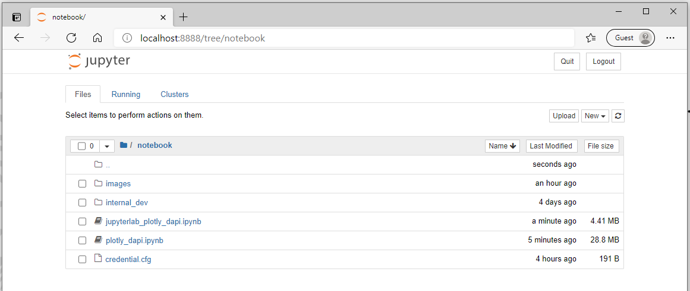
10. Open the *plotly_dapi.ipynb* Notebook document, then go through each notebook cell.

    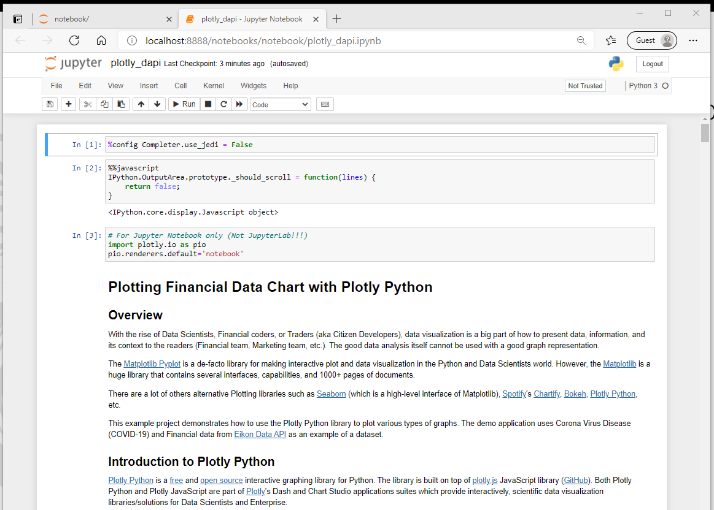

## <a id="running_jupyterlab"></a>How to run this example with the JupyterLab

Please refer to [Plotly Python - JupyterLab Support](https://plotly.com/python/getting-started/#jupyterlab-support) page regarding how to setup JupyterLab, JupyterLab extensions ([Node.js](https://nodejs.org/en/) is required). 

Once you have finished all JupyterLab installation processes, please follow step 5 in the above [section](#running_notebook) but open the file *jupyterlab_plotly_dapi.ipynb* instead. 

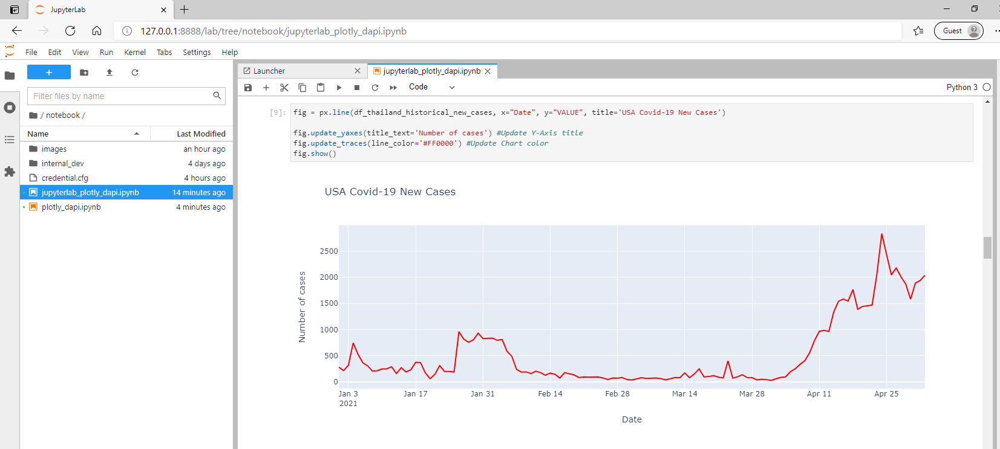

## <a id="running_codebook"></a>How to run this example with the CodeBook

If you are [Refinitiv Workspace](https://www.refinitiv.com/en/products/refinitiv-workspace) or [Eikon](https://www.refinitiv.com/en/products/eikon-trading-software) user, you can access [*CodeBook*](https://www.refinitiv.com/en/products/codebook), the cloud-hosted Jupyter Notebook development environment for Python scripting from the application. The CodeBook is natively available in Refinitiv Workspace and Eikon as an app (**no installation required!!**), providing access to Refinitiv APIs that are already pre-installed on the cloud.

The CodeBook also contains Plotly *version 4.5.2*. You can upload the *codebook_plotly_dapi.ipynb* notebook application to the CodeBook with the following steps:

1. In the Eikon/Workspace application, search for the ```CodeBook``` (or ```CODEBK```).

    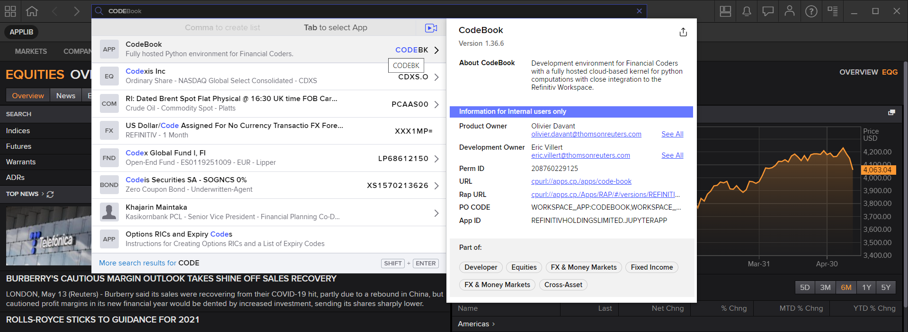
2. Once the CodeBook finished initialize, create a new folder name *plotly*

    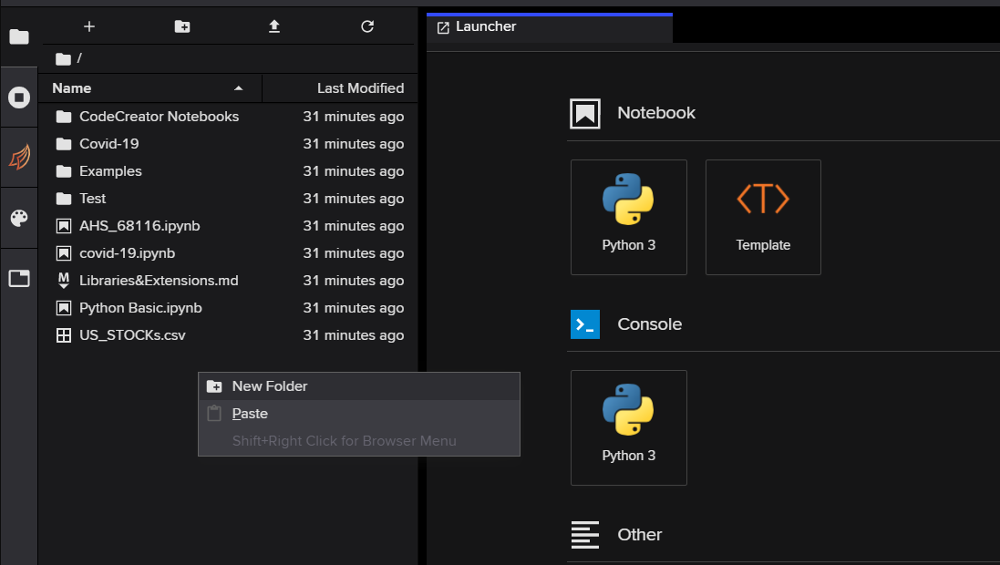

    
3. Enter the plotly folder, and click the upload button and select  *codebook_plotly_dapi.ipynb* notebook file.

    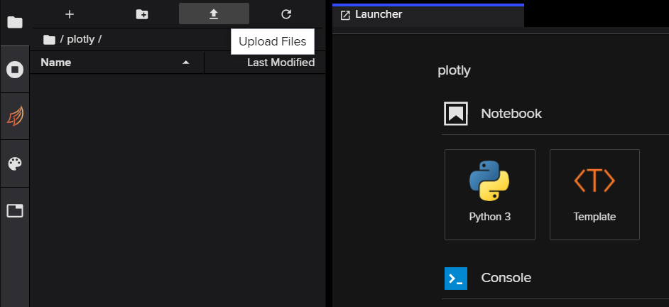
4. Then run through each cell of the Notebook application

    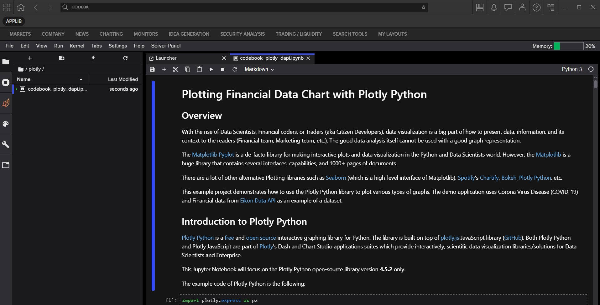

Please see more detail regarding the CodeBook app in this [Use Eikon Data API or RDP Library in Python in CodeBook on Web Browser article](https://developers.refinitiv.com/en/article-catalog/article/use-eikon-data-api-or-rdp-library-python-codebook-web-browser).

## <a id="troubleshooting"></a>Troubleshooting

Sometimes the classic Jupyter Notebook encounters the problem when you close the notebook window and re-open it, your plots render as blank spaces. 

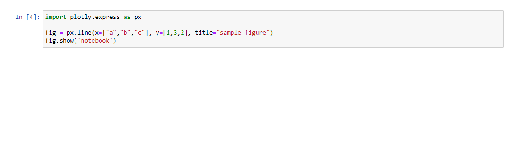

You can check if the notebook document **is trusted** on the top-right menu of the notebook application.

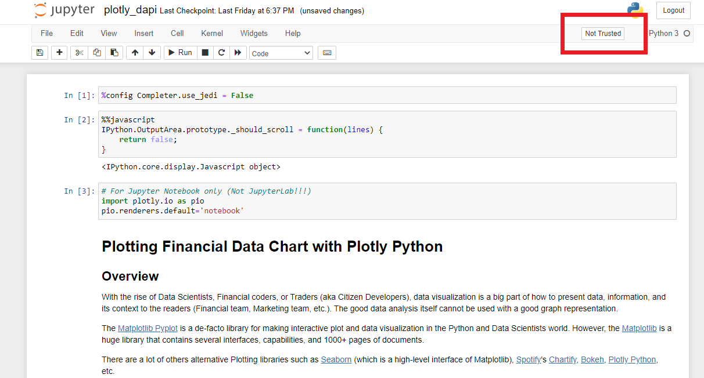

Please click that button to enable JavaScript for display in this notebook.

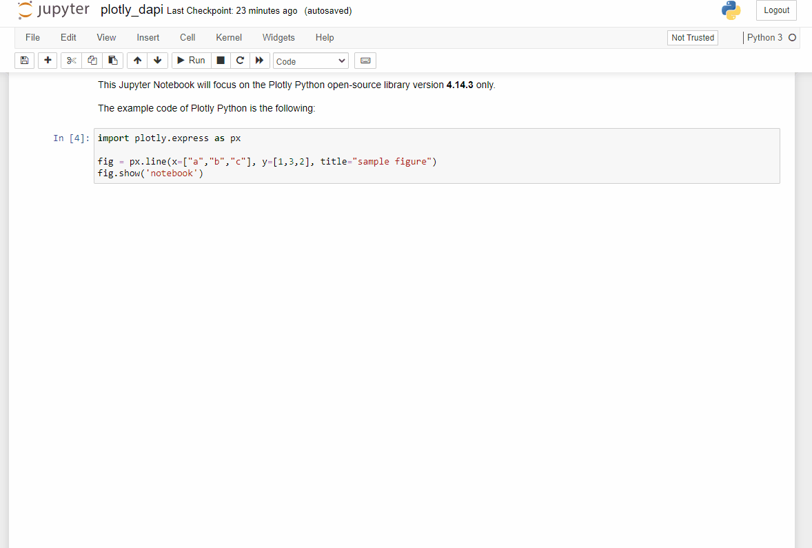

As a last resort, you can "Restart & Clear Output" from the Kernel menu and rerun your notebook. You can find more detail on [Jupyter Classic Notebook Problems](https://plotly.com/python/troubleshooting/#jupyter-classic-notebook-problems) and [Troubleshooting](https://plotly.com/python/troubleshooting/#) pages.

## <a id="conclusion"></a>Conclusion

Data visualization is the first impression of data analysis for the readers.  Data Scientists, Financial coders, and Developers take time on the data visualization process longer than the time they use for getting the data. It means the data visualization/chart library need to be easy to use, flexible and have a good document.

[Plotly Python](https://plotly.com/python/) provides both ease-of-use/high-level and low-level interface for supporting a wide range of Developers' skills. Developers can pick the Plotly Chart object (line, bar, scatter, candlestick, etc) that match their requirements, check the Plotly example code and community page to create a nice chart with readable and easy to maintain source code. 

When compare to the Matplotlib Pyplot (which is the main player in the Charting library), the Plotly advantages and disadvantages are the following:

####  Pros
1. Use a few lines of code to create and customize the graph. 
2. Provide more than 30 ease-of-use various chart object types for Developers.
3. Experience Developers can use the low-level chart object types to create a more powerful and flexible chart.
4. Simplify documents and example code.
5. Provide a dedicated [paid support program](https://plotly.com/get-pricing/) for both individual and corporate developers.

#### Cons
1. Some API Interface and installation processes for Classic Jupyter Notebook and Jupyter Lab are different.
2. Matplotlib Pyplot has larger users based on developer community websites (such as [StackOverflow](https://stackoverflow.com/)). It means a lot of Pyplot questions, problems will be easy to find the answers or solutions than Plotly. 
3. Matplotlib Pyplot has larger documents, tutorials, step-by-step guide resources from both official and user-based websites.
4. The plots render as blank spaces sometimes when you reopen the classic Jupyter Notebook (see [troubleshooting page](https://plotly.com/python/troubleshooting/#jupyter-classic-notebook-problems))


At the same time, the [Eikon Data API](https://developers.refinitiv.com/en/api-catalog/eikon/eikon-data-api) lets developers rapidly access Refinitiv Eikon/Refinitiv Workspace data and our latest platform capabilities with a few lines of code that easy to understand and maintain.

## <a id="references"></a>References

You can find more detail regarding the Plotly, Eikon Data APIs, and related technologies from the following resources:
* [Refinitiv Eikon Data API page](https://developers.refinitiv.com/en/api-catalog/eikon/eikon-data-api) on the [Refinitiv Developer Community](https://developers.refinitiv.com/) web site.
* [Plotly Official page](https://plotly.com/).
* [Plotly Python page](https://plotly.com/python/).
* [Plotly GitHub page](https://github.com/plotly/plotly.py)
* [Plotly Express page](https://plotly.com/python/plotly-express/)
* [Plotly Graph Objects page](https://plotly.com/python/graph-objects/)
* [Creating and Updating Figures in Python page](https://plotly.com/python/creating-and-updating-figures/#updating-figures)
* [Plotly Figure API reference page](https://plotly.com/python-api-reference/generated/plotly.graph_objects.Figure.html)
* [4 Reasons Why I’m Choosing Plotly as My Main Visualization Library](https://towardsdatascience.com/4-reasons-why-im-choosing-plotly-as-the-main-visualization-library-dc4a961a402f)
* [Eikon Data API Quick Start Guide page](https://developers.refinitiv.com/en/api-catalog/eikon/eikon-data-api/quick-start).
* [Eikon Data API Tutorial page](https://developers.refinitiv.com/en/api-catalog/eikon/eikon-data-api/tutorials).
* [Python Quants Video Tutorial Series for Eikon API](https://community.developers.refinitiv.com/questions/37865/announcement-new-python-quants-video-tutorial-seri.html).
* [Eikon Data APY Python Reference Guide](https://developers.refinitiv.com/en/api-catalog/eikon/eikon-data-api/documentation#eikon-data-ap-is-for-python-reference-guide).
* [Eikon Data API Troubleshooting article](https://developers.refinitiv.com/en/article-catalog/article/eikon-data-api-python-troubleshooting-refinitiv).
* [Get Corona Virus Cases Latest And Time-series Statistic with Eikon Data API(Python) example](https://github.com/Refinitiv-API-Samples/Article.EikonAPI.Python.CoronavirusStatistic)

For any question related to this example or Eikon Data API, please use the Developers Community [Q&A Forum](https://community.developers.refinitiv.com/spaces/92/eikon-scripting-apis.html).